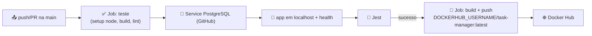

>Discente: Lucas Cavalcante dos Santos | cavalcanteprofissional@outlook.com\
>Docente: Diego Luis Pires | dl.pires@sidi.org.br\
>Disciplina: Práticas de DevOps (Terraform)\
>Instituição: SiDi SOFTEX

# Infraestrutura como Código com Terraform — Observabilidade Kubernetes

Este documento descreve o provisionamento **via Terraform** de um cluster
**Kubernetes local (k3d)** com observabilidade completa, aplicando os conceitos
fundamentais da disciplina: **IaC (Terraform)**, **k3d**, **Deployment**,
**PostgreSQL**, **Helm** (`kube-prometheus-stack` + `loki-stack`), **Prometheus**
(métricas), **Loki + Promtail** (logs) e **Grafana** (dashboard com painéis de
métricas e de logs). Inclui também um **CI/CD bônus** (GitHub Actions →
Docker Hub).

Inclui o **índice de evidências** (prints de tela do navegador e do terminal) e
o **log de console** com as saídas reais dos comandos executados.

---

## 1. Visão Geral

O Terraform cria e destrói **toda** a infraestrutura de forma declarativa:

| Recurso | O que é | Acesso |
|---------|---------|--------|
| Cluster k3d `observabilidade` | 1 server + 1 agent (k3s v1.35.5) | — |
| App `task-manager` | Next.js 14 (Deployment, NodePort 30010) | `http://localhost:3000` |
| `postgres` | PostgreSQL 15 (Deployment + Service ClusterIP 5432) | interno |
| `kube-prometheus-stack` | Prometheus + Alertmanager + Grafana (Helm) | Grafana `http://localhost:3001` |
| `loki-stack` | Loki + Promtail (Helm) | logs via Promtail |
| Dashboard Grafana | 4 painéis (CPU, memória, rede, logs) | `admin / prom-operator` |
| CI/CD (bônus) | GitHub Actions → build/push Docker Hub | link do run |

Fluxo de imagens: **build local + `k3d image import`** (sem depender do Docker
Hub no runtime; `imagePullPolicy: IfNotPresent`).

---

## 2. Arquitetura

```mermaid
flowchart TB
    Dev["👨‍💻 Desenvolvedor<br/>(Terraform CLI)"]

    subgraph TERRAFORM["Terraform (IaC)"]
        TF["provider.tf + variables.tf + cluster.tf<br/>+ app.tf + observability.tf + dashboards.tf"]
    end

    subgraph CLUSTER["CLUSTER k3d: observabilidade"]
        subgraph NSAPP["Namespace: task-manager"]
            DEPLOY["Deployment task-manager<br/>Next.js :3000"]
            SVC["Service NodePort<br/>30010 → :3000"]
            PG["Deployment postgres<br/>PostgreSQL 15 :5432"]
            SVCPG["Service ClusterIP<br/>postgres:5432 (interno)"]
        end
        subgraph NSMON["Namespace: monitoring"]
            PROM["Prometheus<br/>(kube-prometheus-stack)"]
            GRAF["Grafana<br/>NodePort :30009 → :80"]
            LOKI["Loki + Promtail<br/>(loki-stack)"]
            DSH["Dashboard<br/>Task-Manager Observabilidade"]
        end
    end

    DH["Docker Hub / imagem local<br/>task-manager:latest"]

    Dev -->|terraform init / plan / apply| TF
    TF -->|k3d cluster create + import imagem| CLUSTER
    TF -->|kubectl apply -f k8s/| NSAPP
    TF -->|helm install charts| NSMON
    TF -->|kubectl apply -f dashboards/| NSMON

    DH --> DEPLOY
    DEPLOY -->|conecta via DNS| SVCPG
    SVCPG --> PG

    PROM -->|scrape métricas (cAdvisor/kubelet)| DEPLOY
    PROM -->|scrape métricas| PG
    PROM -->|scrape| GRAF
    LOKI -->|promtail coleta logs| DEPLOY
    LOKI -->|promtail coleta logs| PG
    GRAF --> DSH

    UserApp["🌐 http://localhost:3000"] --> SVC
    UserGraf["🖥️ http://localhost:3001"] --> GRAF
```

**Fluxo de dados de observabilidade:**

`Grafana → Prometheus (métricas cAdvisor) + Loki (logs via Promtail) → painéis
do dashboard "Task-Manager Observabilidade"`

---

## 3. Estrutura do Projeto

```
task-manager/
├─ terraform/
│  ├─ provider.tf                   # provider helm + config_path=./kubeconfig
│  ├─ variables.tf                  # cluster=observabilidade, portas, kubeconfig_path
│  ├─ cluster.tf                    # k3d create/wait + kubeconfig + docker build + k3d import
│  ├─ app.tf                        # kubectl apply -f ../k8s/ (namespace 1º + demais)
│  ├─ observability.tf              # helm: kube-prometheus-stack + loki-stack
│  ├─ dashboards.tf                 # kubectl apply do ConfigMap do dashboard
│  ├─ outputs.tf                    # acessos app/grafana + comandos úteis
│  ├─ values/
│  │  ├─ kube-prometheus-stack.yaml # admin prom-operator, datasource Loki, sidecar dashboards
│  │  └─ loki-stack.yaml            # promtail, sem grafana embutido
│  └─ dashboard-task-manager.json   # painel métricas + painel logs
├─ k8s/
│  ├─ namespace.yaml                # ns task-manager
│  ├─ configmap.yaml                # DATABASE_HOST=postgres-service, DB, PORT 3000
│  ├─ secret.yaml                   # credenciais PostgreSQL
│  ├─ postgres-deployment.yaml      # postgres:15 (envFrom configmap+secret, probes)
│  ├─ postgres-service.yaml         # ClusterIP 5432
│  ├─ deployment.yaml               # app task-manager:latest (:3000, probes /api/health)
│  └─ service.yaml                  # NodePort 30010
├─ dashboards/
│  └─ grafana-dashboard.yaml        # ConfigMap do dashboard (label grafana_dashboard)
├─ .github/workflows/ci.yml         # CI/CD Docker Hub (bônus)
└─ README.md                        # este documento
```

---

## 4. Configuração Declarativa

### 4.1 Cluster — via `cluster.tf`

Um `null_resource` com `local-exec` executa:

```bash
k3d cluster create observabilidade \
  --servers 1 --agents 1 \
  -p 3000:3000@server:0 -p 3001:3001@server:0 \
  --k3s-arg "--disable=traefik@server:0"
k3d kubeconfig get observabilidade > kubeconfig
```

> As portas `3000` e `3001` são mapeadas do host para o server node.

### 4.2 Aplicação — via `app.tf`

Aplica o **namespace primeiro** e aguarda ficar `Active`, depois o restante
(evita o *race* do `kubectl apply` ao aplicar tudo de uma vez):

```bash
kubectl apply -f ../k8s/namespace.yaml
kubectl wait --for=jsonpath='{.status.phase}'=Active namespace/task-manager
kubectl apply -f ../k8s/configmap.yaml -f ../k8s/secret.yaml \
              -f ../k8s/postgres-deployment.yaml -f ../k8s/postgres-service.yaml \
              -f ../k8s/deployment.yaml -f ../k8s/service.yaml
kubectl -n task-manager rollout status deploy/task-manager
```

O `ConfigMap` injeta `DATABASE_HOST=postgres-service`, nome/usuário do banco e
`PORT=3000`; o `Secret` injeta a senha do PostgreSQL e do app.

### 4.3 Observabilidade — via `observability.tf` (Helm)

```bash
helm install kube-prometheus-stack . -n monitoring  # charts 88.6.1
helm install loki-stack . -n monitoring             # charts 2.10.3
```

`values/kube-prometheus-stack.yaml` define `adminPassword: prom-operator`,
exposição do Grafana via NodePort 30009 e o **datasource Loki** (uid `loki`).
O dashboard JSON (CPU/memória/rede/logs) é entregue por um ConfigMap com o
label `grafana_dashboard: "1"` carregado automaticamente pelo **sidecar** do
Grafana via `dashboards.tf`.

---

## 5. Decisões de Arquitetura (e por quê)

| Decisão | Justificativa |
|---------|---------------|
| **IaC com Terraform** (k3d, kubectl, helm) | Infra reprodutível/destruível (`terraform apply`/`destroy`), sem cliques manuais |
| **App e banco separados** | Boa prática: escalar o Deployment não duplica o banco; isolamento de ciclo de vida |
| **Permissões não-persistentes** na observabilidade | Demo local: sem PVC para Prometheus/Loki/Grafana (evita storage desnecessário) |
| **Imagem local + `k3d image import`** | Runtime não depende do Docker Hub; evita `ErrImagePull` por rate-limit |
| **`kubectl apply` ordenado no app.tf** | Namespace primeiro + `kubectl wait` evita o *race* que quebrava configmap/deployment |
| **Provider `hashicorp/helm`** | Instala os charts direto do Terraform (idempotente, converge ao re-aplicar) |

---

## 6. Procedimento de Deploy

### 6.1 Pré-requisitos

- Docker Desktop rodando
- kubectl, k3d, Terraform (e Helm opcional)
- Node.js 20+ (build da imagem)

### 6.2 Inicializar, planejar e aplicar

```bash
cd task-manager/terraform
terraform init
terraform plan
terraform apply -auto-approve
```

O apply (1ª execução) provisiona: cluster k3d → build+import da imagem →
manifests da app → charts Helm → dashboard. Execuções seguintes convergem
(plan sem diffs).

### 6.3 Validar

```bash
kubectl -n task-manager get pods --kubeconfig ./kubeconfig
helm list -n monitoring --kubeconfig ./kubeconfig

# Acessos:
#   http://localhost:3000   (app task-manager)
#   http://localhost:3001   (Grafana — admin / prom-operator)
```

### 6.4 Destruir

```bash
cd task-manager/terraform
terraform destroy -auto-approve
```

---

## 7. Testes / Validação (Critérios de Aceite — executados com sucesso)

> Validados em 30/08/2026 no cluster `observabilidade`.

- [x] `terraform init` + `validate` + `plan`/`apply` sem erros e **`plan` sem diffs**
- [x] Cluster k3d `observabilidade` criado (1 server + 1 agent), nós `Ready`
- [x] `kubectl -n task-manager get pods` → `task-manager` e `postgres` `1/1 Running`
- [x] App responde `200` em `http://localhost:3000` e `/api/health` → `{"status":"ok"}`
- [x] `helm list -n monitoring` → `kube-prometheus-stack-88.6.1` e `loki-stack-2.10.3` `deployed`
- [x] **Prometheus coletando** métricas da task-manager (CPU + memória retornam valores; 17 targets UP)
- [x] **Loki recebendo** logs do ns `task-manager` via Promtail (streams com entradas reais)
- [x] **Grafana** `http://localhost:3001` (login `admin/prom-operator`, v13.2.0)
- [x] **Dashboard "Task-Manager Observabilidade"** com 4 painéis (CPU, memória, rede, **logs Loki**)
- [x] Secret do Grafana: usuário `admin`, senha `prom-operator`

---

## 8. Evidências de Execução (Impressões de Tela)

> Os arquivos de imagem estão na pasta **`prints/`** (mantidos localmente; não
> versionados). Este índice e o log de console (seção 9) são o registro oficial.

### 8.1 Navegador (aplicações e observabilidade no ar)

| Arquivo | URL acessada | O que evidencia |
|---------|--------------|-----------------|
| `app-localhost.png` | `http://localhost:3000` | task-manager (Next.js) no ar |
| `app-health.png` | `http://localhost:3000/api/health` | health check `{"status":"ok"}` |
| `prometheus.png` | `http://localhost:9090/graph?g0.expr=...` | Prometheus graph com query de CPU da task-manager |
| `grafana-login.png` | `http://localhost:3001/login` | página de login do Grafana (exige credenciais) |
| `grafana-dashboard.png` | `…/d/task-manager-observabilidade…?kiosk` | dashboard logado com painéis (CPU/mem/rede) |
| `grafana-dashboard-logs.png` | `…?viewPanel=3&kiosk` | painel de **logs Loki** do dashboard |
| `grafana-datasources.png` | `http://localhost:3001/datasources` | datasources configurados (inclui Loki) |
| `tela-real.png` | — | screenshot real da tela do ambiente de execução |

### 8.2 Terminal (estado e comportamento do cluster)

| Arquivo | Comando principal | O que evidencia |
|---------|-------------------|-----------------|
| `01-terraform-init-plan-validate.png` | `terraform init` / `plan` / `validate` | IaC sem erros |
| `02-terraform-apply.png` | `terraform apply` | provisionamento do cluster/app/nav observabilidade |
| `03-terraform-apply-2.png` | `terraform apply` (convergência app) | rac resetado; app criada (1 add) |
| `10-pods-running.png` | `kubectl get pods -A` | app/monitoring todos `Running` |
| `11-helm-release.png` | `helm list -n monitoring` | 2 charts `deployed` |
| `12-kubectl-all.png` | `kubectl -n task-manager get all` + `-n monitoring get all` | workloads e serviços saudáveis |
| `13-prometheus-metric.png` | Prometheus query CPU/memória | métricas coletadas da app |
| `14-loki-log.png` | Loki `{namespace="task-manager"}` | logs reais da app (Loki/Promtail) |

> Obs.: `prints/` está no `.gitignore` — as evidências ficam apenas no ambiente
> local, sendo referenciadas por este índice.

---

## 9. Log de Console — Evidências de Execução

Registro textual (comandos + saídas) correspondente aos prints das seções 8.1 e
8.2, com os valores reais capturados.

### [1] `terraform plan` — sem diffs (infra converge)

```text
$ terraform plan
null_resource.cluster: Refreshing state...
null_resource.app: Refreshing state...
helm_release.kube_prometheus_stack: Refreshing state...
helm_release.loki_stack: Refreshing state...
null_resource.dashboard: Refreshing state...

No changes. Your infrastructure matches the configuration.
```

### [2] `terraform apply` (convergência da app) — resolveram o race do namespace

```text
$ terraform apply plan.tfplan
null_resource.app: Destroying... [id=1870825335532445784]
null_resource.app: Creation complete after 22s [id=2885100421743594171]

configmap/task-manager-config created
secret/task-manager-secret configured
deployment.apps/postgres unchanged
service/postgres-service unchanged
deployment.apps/task-manager created
service/task-manager-service unchanged
deployment "task-manager" successfully rolled out

Apply complete! Resources: 1 added, 0 changed, 1 destroyed.
```

### [3] `kubectl get pods -A` — tudo Running

```text
$ kubectl get pods -A
NAMESPACE      NAME                                                        READY   STATUS    RESTARTS   AGE
monitoring     kube-prometheus-stack-grafana-ff48cc9f-2s726                3/3     Running   0          11m
monitoring     kube-prometheus-stack-prometheus-0                          2/2     Running   0          10m
monitoring     alertmanager-kube-prometheus-stack-alertmanager-0           2/2     Running   0          10m
monitoring     loki-stack-0                                                1/1     Running   0          6m
monitoring     loki-stack-promtail-*                                      1/1     Running   0          6m
task-manager   postgres-5f8bf8d788-b8c64                                   1/1     Running   1 (…)     13m
task-manager   task-manager-74795f55fd-ht7kd                               1/1     Running   0          2m
```

### [4] `helm list -n monitoring` — 2 charts deployed

```text
$ helm list -n monitoring
NAME                 	NAMESPACE 	REVISION	UPDATED     	STATUS  	CHART                	APP VERSION
kube-prometheus-stack	monitoring	1       	2026-08-30 …	deployed	kube-prometheus-stack-88.6.1	v0.93.1
loki-stack           	monitoring	1       	2026-08-30 …	deployed	loki-stack-2.10.3           	v2.9.3
```

### [5] Prometheus — métricas coletadas da app

```text
$ Prometheus: rate(container_cpu_usage_seconds_total{namespace="task-manager"}[5m])
  pod=postgres-5f8bf8d788-b8c64   cpu cores=0.02
  pod=task-manager-74795f55fd-ht7kd cpu cores=0.01

$ Prometheus: container_memory_working_set_bytes{namespace="task-manager"}
  pod=postgres-5f8bf8d788-b8c64   mem=52.0 MiB
  pod=task-manager-74795f55fd-ht7kd mem=39.5 MiB

$ Prometheus: count(up == 1) → 17 targets UP
```

### [6] Loki — logs do namespace task-manager via Promtail

```text
$ curl 'http://localhost:3100/loki/api/v1/query_range'
  task-manager-…: ✅ Database initialized successfully
  task-manager-…: > Ready on http://0.0.0.0:3000
  postgres-…: 2026-08-30 … LOG:  checkpoint starting
  postgres-…: 2026-08-30 … LOG:  checkpoint complete: wrote 25 buffers
```

### [7] App — health check

```text
$ curl http://localhost:3000/api/health
{"status":"ok","service":"task-manager","timestamp":"2026-08-30T03:19:01.307Z"}
```

### [7b] App — CRUD (banco + Secret funcionando)

```text
$ curl -s -X POST http://localhost:3000/api/tasks -H "Content-Type: application/json" \
    -d '{"title":"Evidencia Terraform DevOps","description":"atividade 43","priority":"alta","status":"pendente"}'
{"task":{"id":"c80c7c98-…","title":"Evidencia Terraform DevOps",…,"priority":"alta"}}

$ curl -s http://localhost:3000/api/tasks
{"tasks":[{"id":"c80c7c98-…","title":"Evidencia Terraform DevOps","description":"atividade 43",…}]}
```

### [8] Grafana — acesso e dashboard provisionado

```text
$ kubectl -n monitoring get secret kube-prometheus-stack-grafana -o jsonpath='{.data.admin-password}' | base64 -d
prom-operator

$ curl -H "Authorization: Basic …" http://localhost:3001/api/search?type=dash-db
  uid=task-manager-observabilidade | Task-Manager Observabilidade
```

---

## 10. Conceitos Demonstrados (resumo didático)

| Conceito | Recurso usado | Exemplo no projeto |
|----------|---------------|--------------------|
| IaC | Terraform (`null_resource` + `local-exec` + provider `helm`) | todo o `terraform/` |
| Provisionamento de cluster | k3d | cluster `observabilidade` |
| Deploy declarativo | `kubectl apply` | `k8s/` |
| Config externa | ConfigMap | `DATABASE_HOST`, `PORT` |
| Segredos | Secret | senha do PostgreSQL |
| Package Manager | Helm | kube-prometheus-stack, loki-stack |
| Métricas | Prometheus (cAdvisor/kubelet) | CPU/memória/rede da app |
| Logs | Loki + Promtail | `{namespace="task-manager"}` |
| Visualização | Grafana | dashboard 4 painéis |
| CI/CD (bônus) | GitHub Actions → Docker Hub | workflow `ci.yml` |

---

## 11. Referência de Comandos Úteis

```bash
cd task-manager/terraform
terraform plan / apply / destroy
kubectl -n task-manager get pods --kubeconfig ./kubeconfig
helm list -n monitoring --kubeconfig ./kubeconfig
kubectl -n monitoring port-forward svc/kube-prometheus-stack-prometheus 9090:9090 --kubeconfig ./kubeconfig
kubectl -n monitoring port-forward svc/loki-stack 3100:3100 --kubeconfig ./kubeconfig
```

---

## 12. Solução de Problemas Comuns

- **`namespaces "task-manager" not found` no apply** → race do `kubectl apply`;
  corrigido aplicando o namespace primeiro + `kubectl wait` (ver `app.tf`).
- **`ErrImagePull`** → imagem ausente no nó; use `k3d image import task-manager:latest -c observabilidade`.
- **Grafana pede login** → `admin` / `prom-operator` (secret criado pelo chart).
- **Grafana sem painéis** → confira se o dashboard ConfigMap tem o label
  `grafana_dashboard: "1"` no ns `monitoring` e se o sidecar carregou.
- **Docker Desktop "erro 500" em `exec` de nós k3d** → intermitente do engine
  WSL2; o `cluster.tf` tem retry no `k3d image import`. Confirme a imagem com
  `crictl images` nos nós.

---

## 13. Bônus — CI/CD (GitHub Actions → Docker Hub)

O workflow `.github/workflows/ci.yml` dispara em `push`/`PR` para `main`:



Segredos necessários no fork (`Settings → Secrets and variables → Actions`):
`DOCKERHUB_USERNAME` e `DOCKERHUB_TOKEN`. Push **apenas no fork**
`cavalcanteprofissional/task-manager` (nunca no repositório do professor).

---

*Disciplina: Práticas de DevOps (Terraform) · Residência Tecnológica SiDi SOFTEX*
